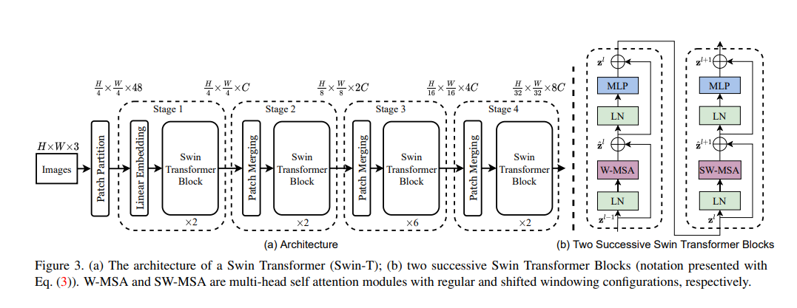
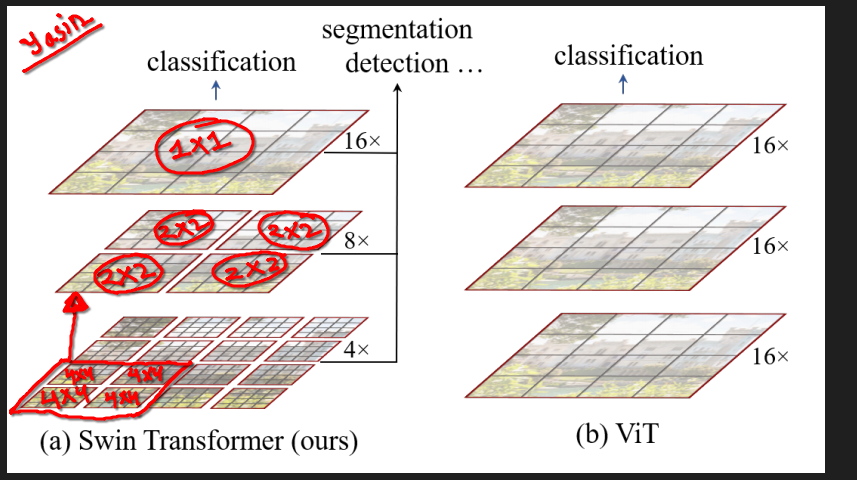

<br>
<br>

# `# Swin Transformer:`

<br>
<br>


An overview of the Swin Transformer architecture is presented in Figure 3, which illustrates the tiny version (SwinT). It first splits an input RGB image into non-overlapping patches by a patch splitting module, like ViT. Each patch is
treated as a “token” and its feature is set as a concatenation of the raw pixel RGB values. In our implementation, we use a patch size of 4 × 4 and thus the feature dimension of each patch is 4 × 4 × 3 = 48. A linear embedding layer is applied on this raw-valued feature to project it to an arbitrary dimension (denoted as C).

`In Linear Projection we use, Conv2D Layer where, Kernel_size=(4x4) stride=(4,4), output Channel: (C->it's a hyperparameter, 96,192). Like,for image, [224,224,3] -> [56,56,C].`

`আমরা CNN দেখেছি, যদি image [6,6,3] হয় এতে convolution operation perform করলে, kernel_size =(3,3) এর জন্য তাহলে, convolution operation শেষ হলে  আমরা (4,4,3), 3 dimension feature map পাচ্ছি । যেইটা, আমাদের input image এর dimension এর সমান । এখন, প্রশ্ন হচ্ছে যে, Swin Transformer এ তো আমরা image এর channel dimension বাড়াচ্ছি, তো এইটা কীভাবে হচ্ছে? আর,  channel dimension বাড়ালে, লাভ কি?`

**Channel Dimension বাড়ালে লাভ:**
- Increase feature extraction power:
        কম চ্যানেল (3) শুধুমাত্র রঙ বা সাধারণ প্যাটার্ন ধরতে পারে। বেশি চ্যানেল (যেমন 96) মডেলকে জটিল ফিচার (যেমন OCT-এ রেটিনাল অস্বাভাবিকতা) শিখতে সাহায্য করে।
- মডেলের ক্ষমতা:
        বেশি চ্যানেলের মাধ্যমে মডেল আরও গভীর এবং বিস্তৃত হয়, যা OCT-এর মতো জটিল ডেটায় ভালো কাজ করে।
- Fexibility:
        C-কে টিউন করা যায়, যা বিভিন্ন ডেটাসেটের জন্য মডেলকে উপযোগী করে তোলে।

**How to increase channel dimension:**

`আমরা already CNN এ দেখে এসেছি, RGB image  এর ক্ষেত্রে আমরা kernel 3 টা ব্যবহার করি। তাই, আমরা output feature map এ channel 3 dim এর হয় । যদি 3 টা ব্যবহার করে আরো বেশি করি তাহলে?? হ্যা এইখানে, একই কাজ করা হয় । `



**Patch Partition VS Linear Embedding VS Patch Merging**

```
Input Image [224, 224, 3]
    ↓
Patch Partition → [56, 56, 48] (4×4 patches, each with 48 features)
    ↓
Linear Embedding → [56, 56, C] (Projected to C channels, e.g., C=96)
    ↓
Swin Transformer Block → [56, 56, C] (Feature transformation, token number unchanged)
    ↓
Patch Merging → [28, 28, 2C] (2×2 patch merge, reduces tokens by 4, channel to 2C)
    ↓
Swin Transformer Block → [28, 28, 2C] (Feature transformation)
    ↓
Patch Merging → [14, 14, 4C] (2×2 patch merge, reduces tokens by 4, channel to 4C)
    ↓
Swin Transformer Block → [14, 14, 4C] (Feature transformation)
```

## `Hierarchical Representation:`

**Hierarchical representation** refers to a multi-level structure of features or data where information is organized and processed at various scales or levels of abstraction. In the context of deep learning, particularly in models like the Swin Transformer, it involves extracting low-level details (e.g., edges or textures) at initial stages`(শুরুতে, patch গুলো অনেক  ছোট থাকে তখন, আমরা low-level details গুলো পাই । যখন, এইটা, আস্তে আস্তে বড় হতে থাকে reducing spatial resolution), তখন, overall image এর details পাই । )` and progressively building higher-level abstractions (e.g., patterns or global context) as the network deepens. This is achieved by reducing the spatial resolution (e.g., through patch merging`patch কে merge করা`) while increasing the feature channel depth, allowing the model to capture both local and global information in a layered manner.


To produce a hierarchical representation, the number of tokens is reduced by patch merging layers as the network gets deeper. The first patch merging layer concatenates the features of each group of 2 × 2 neighboring patches, and applies a linear layer on the 4C-dimensional concatenated features. This reduces the number of tokens by a multiple
of 2×2 = 4 (2× downsampling of resolution), and the output dimension is set to 2C.**Like,** 



Something,like we read *max-pooling and average-pooling* in CNN which reduce resolution.


